<div align="center">



</div>

---

<div align="center">


</div>

---

## 🚨 The Problem

Traditional fraud detection runs in **batch mode** — analyzing transactions every 4-6 hours. By the time fraud is detected, money is gone, the account is compromised, and the damage is done.

```
BATCH (old way):     Fraud happens → detected 4-6 hours later → money gone ❌
STREAMING (this):    Fraud happens → detected in < 60 seconds → blocked    ✅
```

---

## 🔍 5 Fraud Detection Rules

| Rule | Logic | Severity |
|:-----|:------|:--------:|
| Amount Threshold | Single transaction > ₹10,000 | HIGH |
| Velocity Check | > 5 transactions in 60 seconds from same card | CRITICAL |
| Location Anomaly | Different city within 10 minutes | HIGH |
| Merchant Blacklist | Known fraud merchant match | CRITICAL |
| Behavioral Spike | Transaction > 50× customer's average | HIGH |

---

## ⚙️ Key Engineering Decisions

**Why exactly-once semantics?** Without it — same transaction processed twice = duplicate fraud alert. Achieved via: Kafka idempotent producer + Spark checkpoint + Redshift MERGE.

**Why Kafka over direct streaming?** If Spark crashes without Kafka, events are lost. With Kafka, Spark restarts and reads from the last committed offset — zero data loss.

**Why Parquet on S3?** Columnar format reads only needed columns. Combined with date partitioning → 40% faster queries.

---

## 📁 Structure

```
├── src/
│   ├── producer/          # Kafka event producer
│   ├── processing/        # Spark streaming + fraud engine
│   ├── storage/           # S3 writer + Redshift loader
│   └── monitoring/        # OpenTelemetry + Prometheus
├── sql/                   # Redshift schemas + analytics queries
├── tests/                 # Unit tests for all 5 fraud rules
├── config/config.yaml
├── docker/docker-compose.yml
└── docs/pipeline.svg      ← animated pipeline above
```

---

## 🚀 Quick Start

```bash
git clone https://github.com/sunildataengineer/Real-Time-Fraud-Anomaly-Detection-Streaming-Platform
docker-compose up -d
pip install -r requirements.txt
python src/producer/kafka_producer.py
spark-submit src/processing/spark_streaming.py
```

---

## 📊 Results

| Metric | Result |
|:-------|:------:|
| Detection Latency | Batch hours → **< 60 seconds** |
| Pipeline Failures | **-80%** |
| Query Performance | **-40%** |
| Data Loss on Failure | **0** |
| Uptime | **99.97%** |

---

## 🧠 What I Learned

Design for exactly-once from day one. My first implementation used at-least-once semantics — when a pipeline failure occurred in testing, the same transactions were processed twice, generating duplicate fraud alerts. **Exactly-once is an architecture decision, not a feature to add later.**

---

<div align="center">

**Sunil Kumar Reddy — Data Engineer**

[](https://www.linkedin.com/in/suniil-data-engineer/)
[](https://sunildataengineer.netlify.app/)
[](https://github.com/sunildataengineer)

*"Bad pipelines fail silently. Good engineers don't let them."*

</div>
